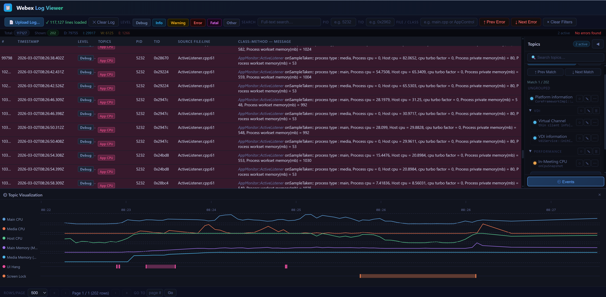
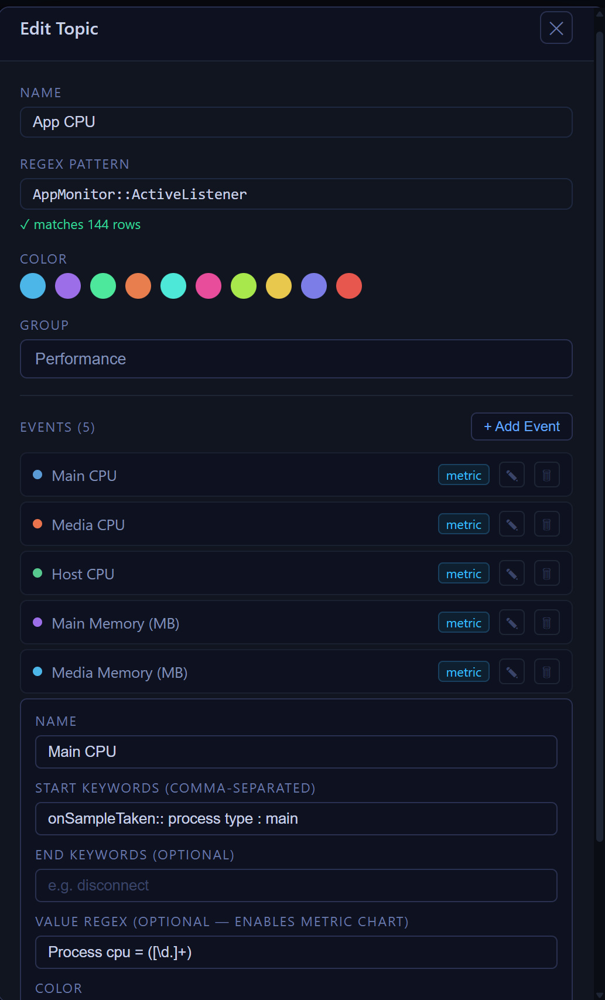

Webex Log Viewer
================

A pure static web app for viewing, filtering, and visualizing Webex client logs.
Deployed on Vercel — no server, no cost.

RUNNING LOCALLY
---------------
No install required. Just serve the project folder with any static file server.

Using Python:

   python3 -m http.server 8099

Using Node (npx):

   npx serve . -l 8099

Then open your browser at:

   http://localhost:8099

LOADING LOGS
------------
Click **"Upload Log…"** in the toolbar and select a `.txt` Webex log file.
The file is parsed in-browser and displayed immediately. Nothing is sent to a server.

To clear the loaded log, click **"✕ Clear Log"** in the toolbar.

TOPICS
------
Topics are regex patterns that highlight and filter matching log lines.
They are stored in your browser's localStorage automatically.

- **Export** — saves your topics to a `topics.json` file (sidebar footer)
- **Import** — loads topics from a `topics.json` file (sidebar footer)
- **Load Defaults** — reloads the built-in default topics from the server
  (only appears if localStorage is empty and the fetch failed)

FEATURES
--------
- Full-text search (plain or regex), level filter, PID / TID / source filters
- Topic-based regex filtering with named color-coded groups
- Events within topics:
    - Dot mode    — start_keywords match individual log lines (shown as dots)
    - Gantt mode  — start_keywords + end_keywords define lifecycle spans
    - Metric mode — start_keywords + value_regex extract numeric values and
                    render as a line chart in the Topic Visualization panel
- Topic Visualization panel — drag the handle at the bottom of the sidebar up
  to reveal the timeline showing all events for enabled topics
- Drag-and-drop topic reordering; collapsible sidebar

DATA PERSISTENCE
----------------
Topics and events are stored in your browser's localStorage.
Use **Export** to back them up as `topics.json` and **Import** to restore them.

The file `topics.json` at the project root contains the default team topics
served on first visit.

TESTING
-------
The project uses Playwright for end-to-end tests.

Install dependencies (first time only):

   npm install
   npx playwright install chromium

Make sure the local server is running at http://localhost:8099, then:

   npx playwright test

All 15 tests run headlessly in ~8 seconds. To watch the tests run visibly,
set `headless: false` in `playwright.config.js`.

PROJECT STRUCTURE
-----------------
index.html          Single-page frontend (vanilla JS, no build step)
static/
  api.js            localStorage adapter — mirrors the old Flask REST API surface
topics.json         Default team topics (served as a static asset)
vercel.json         Vercel deployment config (static site, SPA rewrite rule)
tests/
  fixtures/
    sample.txt      Synthetic Webex log file used by tests
    topics-import.json  Minimal topics JSON used by import tests
  specs/
    smoke.spec.js        Page load, sidebar, toolbar, drag handle
    topics.spec.js       Topic create / edit / delete / persist
    import-export.spec.js  Export download, import round-trip
    log-upload.spec.js   Upload, level filter, text search, clear log
playwright.config.js  Playwright configuration
package.json          Dev dependencies (@playwright/test only)
